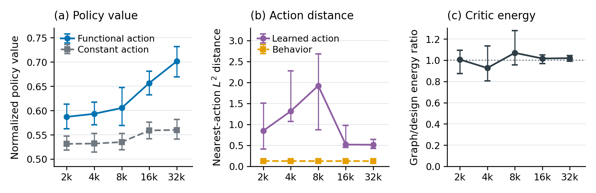

# Functional-Action Fitted Q-Iteration

Simulation code for **Finite-Sample Theory for Fitted Q-Iteration When Actions
Are Functions**.

The experiments use a stochastic Pendulum in which each action is a torque
function. We fit functional-action policies with AdaFNN and Nyström KRR critics,
compare them with separately trained constant-action policies, and examine
critic differences at the learned actions.

You can reproduce the paper figures from the included results, or generate data
and train the models yourself. All data are synthetic.



The main experimental figure compares functional and constant-action policies,
then describes action locality and adjacent-critic energies. These empirical
diagnostics illustrate the experiment; their relationship to the theoretical
quantities is explained in the [notation guide](docs/notation.md).

## Choose a starting point

After [installing the environment](#installation), run commands from the
repository root.

| Goal | Command or guide | Requirements | Output |
| --- | --- | --- | --- |
| Try a small training example | `make quickstart` | CPU and PyTorch | `outputs/quickstart/` |
| Reproduce all six paper figures | `make reproduce` | CPU analysis environment | `outputs/figures/` and `outputs/tables/` |
| Recompute and check the supplied results | `make check` | CPU analysis environment | Figures, checked numerical summaries, and `outputs/paper_results.executed.ipynb` |
| Retrain the paper experiments | [Full training instructions](docs/reproducibility.md#1-generate-the-offline-data) | Training environment and a CUDA GPU | `data/`, `runs/`, then `outputs/new_training/` |

The saved-result workflows need no dataset download or fitted checkpoints.
[Compute requirements](docs/compute.md) describe the scale of each workflow;
[data and model availability](data/README.md) list what is included.

## Reading guide

- [Experiments and equations](docs/experiments.md): environment, FQI, policy
  objective, evaluation, and diagnostics.
- [Paper-to-code notation](docs/notation.md): symbols, coefficient units, and
  distinctions between theoretical errors and empirical diagnostics.
- [Source-code guide](docs/code-guide.md): a reading order through the Python
  implementation, with array shapes and entry points.
- [Reproduction](docs/reproducibility.md): commands for the full experiment.

## Installation

Use Python 3.12. For training and the quickstart:

```bash
conda env create -f environment.yml
conda activate functional-fitted-q-theory
```

For figures and the analysis notebook only, create a CPU environment with the
pinned analysis dependencies:

```bash
python3.12 -m venv .venv
source .venv/bin/activate
python -m pip install -r requirements-analysis.lock.txt
python -m pip install --no-deps -e .
```

To also run the small training example in this environment, install
`torch==2.5.1`. On Linux, the CPU-only wheel is sufficient:

```bash
python -m pip install torch==2.5.1 --index-url https://download.pytorch.org/whl/cpu
```

On macOS, use `python -m pip install torch==2.5.1` instead. Full training uses
the Conda environment above on a machine with a CUDA GPU.

Use a separate environment if another installation provides the
`functional_fitted_q` package. The training environment includes PyTorch;
paper-scale training uses an NVIDIA GPU.

## Quick start

Run a small CPU example with the training environment:

```bash
python examples/quickstart_example.py
```

It generates 30 transitions, fits two FQI iterations, and saves a return summary
and example torque functions in `outputs/quickstart/`. These reduced settings
demonstrate the method; the paper settings are in `configs/paper_simulation.yaml`.

To draw the paper figures from the saved results:

```bash
python scripts/generate_simulation_figures.py
```

The six figures are saved as PDF and PNG files in `outputs/figures/`, with their
numerical summaries in `outputs/tables/`. See [results/README.md](results/README.md)
for the figure list and data columns.

For a clean end-to-end check of the supplied artifact, run:

```bash
make check
```

This runs the tests, reconstructs and compares the figures and numerical
summaries, then executes the analysis notebook. The executed notebook is saved
under `outputs/`; the example notebook stays unchanged.

## Training

Generate seed 0's offline data, then fit an AdaFNN policy using 2,000 transitions
and policy coefficient 0.001:

```bash
python scripts/generate_offline_data.py --seed 0
python scripts/run_functional_fqi.py --approximator adafnn --n 2000 --seed 0 --policy-lambda 0.001
```

For KRR or the constant-action comparator:

```bash
python scripts/run_functional_fqi.py --approximator krr --n 2000 --seed 0 --policy-lambda 0.001
python scripts/run_constant_fqi.py --n 2000 --seed 0
```

Run directories describe the experiment, for example:

```text
data/pendulum-seed00/
runs/candidates/adafnn/adafnn-n2000-lambda0.001-seed00/
runs/candidates/krr/krr-n2000-lambda0.001-seed00/
runs/constant/adafnn-constant-n2000-seed00/
```

The [reproduction guide](docs/reproducibility.md) covers the full grid, coefficient
selection, evaluation, and checkpoint analysis. A [Slurm example](docs/slurm.md)
is provided for submitting one fit. If a run is interrupted, repeat its command
with the same settings to resume from the last saved checkpoint.

## Repository structure

```text
configs/                  Experiment settings and task lists
src/functional_fitted_q/   Environment, policies, critics, FQI, and analysis
scripts/                  Commands for training, evaluation, and plotting
examples/                 Small example, analysis notebook, and Slurm example
data/                     Generated offline trajectories
results/source/           Per-run paper results and fit-level diagnostics
results/reference/        Paper figures and numerical summaries
docs/                     Experimental details and running instructions
tests/                    Tests for settings, selection, statistics, and resume
outputs/                  Generated figures and tables
```

## Experiments

The paper uses 2,000, 4,000, 8,000, 16,000, and 32,000 transitions, with 20 decisions
per subject and seeds 0–19. Each fit runs 20 FQI iterations at discount 0.95.
Policy coefficients are 0.0001, 0.001, 0.01, 0.1, and 1. Policy tuning and reporting
use separate Monte Carlo episodes; KRR critic ridge is selected by subject-grouped
cross-validation.

Details of the reward, architectures, curvature penalty, optimization, and
identification statistics are in [docs/experiments.md](docs/experiments.md).
[Compute requirements](docs/compute.md) and [data availability](data/README.md)
are documented separately. Fitted paper checkpoints are not included; the saved
results are sufficient for plotting, while checkpoint-level analysis requires
retraining. Identification evaluates $`\widehat Q_{19}`$ and $`\widehat Q_{20}`$ on an independent cohort of
$`q=n=NT`$ states, with $`T=20`$. The learned and observed behavior actions are evaluated
at each state in this cohort.

## Tests and analysis notebook

```bash
python -m unittest discover -s tests -v
make verify
make notebook
```

`make verify` regenerates the figures before comparing them with the supplied
results. The notebook walks through
coefficient selection, bootstrap intervals, and critic diagnostics. For a short
training and interrupted-resume test, use the training environment:

```bash
python -m functional_fitted_q smoke
```

## Citation and license

Please cite the accompanying manuscript. `CITATION.cff` contains the software
citation information for anonymous review.

The code is released under the [MIT License](LICENSE).
